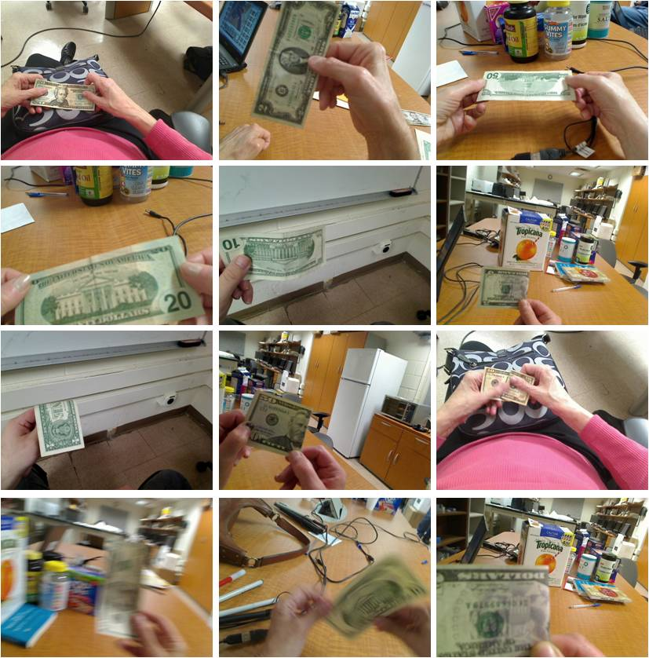
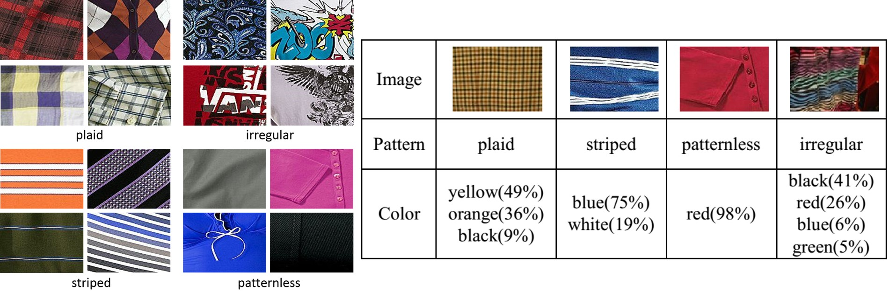

<table width="650" border="0" align="center">
<tr>
<th align="left" bgcolor="#CCCCCC" scope="col">&nbsp;<strong class="style16">Indoor Object Recognition Augmented by Scene Text Recognition</strong></th>
</tr>
</table>

<table width="650" border="0" align="center">
<tr>
<th scope="col"></th>
</tr>

<tr>
<th>
Independent travel is a well known challenge for the visually impaired people. We propose an indoor wayfinding system for assisting visually impaired people to independently access unfamiliar indoor environment. In order to find different rooms (e.g., office, lab, or bathroom) and other building amenities (e.g., exit or elevator), we incorporate the door detection with scene text recognition. The recognized results can be displayed as speech to visually impaired travelers.
</th>
</tr>
</table>

<table width="650" border="0" align="center">
<tr>
<th align="left" bgcolor="#CCCCCC" scope="col">&nbsp;<strong class="style16">Component based Banknote Recognition</strong></th>
</tr>
</table>

<table width="650" border="0" align="center">
<tr>
<th scope="col"></th>
</tr>

<tr>
<th>
We develop a camera-based system to automatically recognize banknotes to assist visually impaired people. Our method is robust to a variety of conditions including occlusion, rotation, scaling, cluttered background, illumination change, viewpoint variation, and worn or wrinkled bills, as illustrated in the above figure.
</th>
</tr>
</table>

<table width="650" border="0" align="center">
<tr>
<th align="left" bgcolor="#CCCCCC" scope="col">&nbsp;<strong class="style16">Clothing Pattern and Color Recognition</strong></th>
</tr>
</table>

<table width="650" border="0" align="center">
<tr>
<th scope="col"></th>
</tr>

<tr>
<th>
We develop a camera-based prototype system for visually impaired people to automatically recognize clothing patterns into 4 basic categories, i.e., plaid, stripped, patternless, and irregular, as well as to identify 11 clothing colors. If a clothing image contains multiple colors, the dominant colors will be output. The clothing patterns and colors mutually provide complementary information to understand how the patterns or colors are arranged.
</th>
</tr>
</table>

<table width="650" border="0" align="center">
<tr>
<th align="left" bgcolor="#CCCCCC" scope="col">&nbsp;<strong class="style16">Related Publications</strong></th>
</tr>
</table>

Y. Tian, **X. Yang**, C. Yi, and A. Arditi. Toward A Computer Vision based Wayfinding Aid for Blind Persons to Access Unfamiliar Indoor Environments. Machine Vision and Applications (MVA), 24(3), 521-535, 2013. [[PDF](/publications/papers/Navigation_MVA.pdf)]

F. Zaman, **X. Yang**, and Y. Tian. Robust and Effective Component based Banknote Recognition for the Blind. IEEE Transactions on System, Man, and Cybernetics (TSMC) Part C, 42(6), 1021-1030, 2012. [[PDF](/publications/papers/Banknote_TSMC.pdf)]

**X. Yang**, S. Yuan, and Y. Tian. Assistive Clothing Pattern Recognition for Visually Impaired People. IEEE Transactions on Human-Machine Systems (THMS), 44(2), 234-243, 2014. [[PDF](/publications/papers/Clothing_Patterns.pdf)]