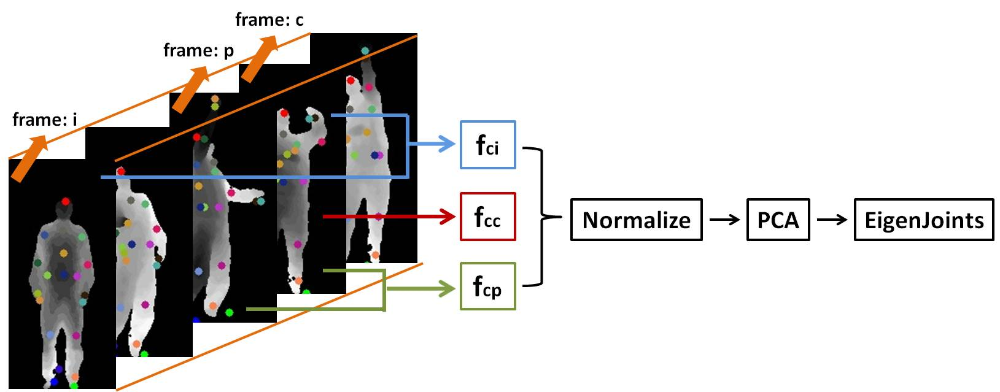
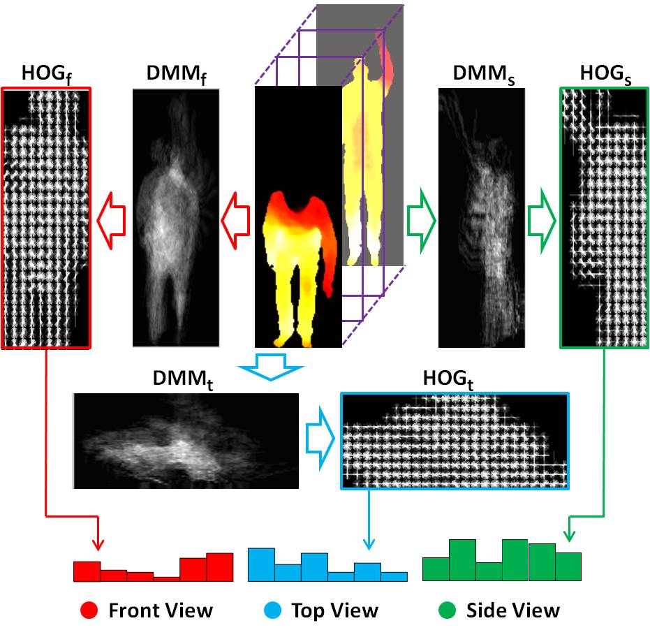
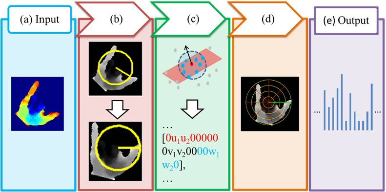

<table width="650" border="0" align="center">
<tr>
<th align="left" bgcolor="#CCCCCC" scope="col">&nbsp;<strong class="style16">Abstract</strong></th>
</tr>
</table>

<table width="650" border="0" align="center">
<tr>
<th scope="col">
We developed three effective features, i.e., EigenJoints, DMM-HOG, and H3DF, for human activity and hand gesture recognition using depth cameras. EigenJoints combines action information including static posture, motion, and offset based on skeleton joint differences. DMM-HOG is obtained by computing HOG from Depth Motion Maps (DMM). DMM is generated by projecting depth maps onto three orthogonal planes and accumulating global activities through entire video sequences. Histogram of 3D Facets (H3DF) is computed based on surface normal coding and concentric spatial pooling.
</th>
</tr>
</table>

<table width="650" border="0" align="center">
<tr>
<th align="left" bgcolor="#CCCCCC" scope="col">&nbsp;<strong class="style16">EigenJoints</strong></th>
</tr>
</table>

<table width="650" border="0" align="center">
<tr>
<th scope="col"></th>
</tr>

<tr>
<th>
The framework of computing EigenJoints is illustrated in the above figure. In each frame, we compute three feature channels to capture the information of static posture, successive motion, and dynamic offset. The normalization and PCA are then applied to obtain EigenJoints descriptor of each frame.
</th>
</tr>
</table>

<table width="650" border="0" align="center">
<tr>
<th align="left" bgcolor="#CCCCCC" scope="col">&nbsp;<strong class="style16">DMM-HOG</strong></th>
</tr>
</table>

<table width="650" border="0" align="center">
<tr>
<th scope="col"></th>
</tr>

<tr>
<th>
Each depth map is first projected onto three orthogonal Cartesian planes by front, side, and top views. We set the region of interest of each projected map as the bounding box of foreground region, which is normalized to a fixed size according to subject heights and motion extents. For each projected map, we obtain its motion energy by computing and thresholding the difference between two consecutive maps. The binary map of motion energy indicates motion regions. This provides a strong clue of the action category being performed. We then stack the motion energy through the entire video sequence to generate the Depth Motion Maps (DMM).
</th>
</tr>
</table>

<table width="650" border="0" align="center">
<tr>
<th align="left" bgcolor="#CCCCCC" scope="col">&nbsp;<strong class="style16">H3DF</strong></th>
</tr>
</table>

<table width="650" border="0" align="center">
<tr>
<th scope="col"></th>
</tr>

<tr>
<th>
H3DF is proposed to explicitly encode the 3D shape cues from depth maps. A 3D facet is defined as a 3D local surface associated with each cloud point. The pipeline of computing H3DF is from (a) the input region of interest of a depth map, (b) orientation normalization, (c) facet coding, (d) concentric spatial pooling, to (e) the output descriptor.
</th>
</tr>
</table>

<table width="650" border="0" align="center">
<tr>
<th align="left" bgcolor="#CCCCCC" scope="col">&nbsp;<strong class="style16">Related Publications</strong></th>
</tr>
</table>

**X. Yang** and Y. Tian. Effective 3D Action Recognition Using EigenJoints. Journal of Visual Communication and Image Representation (JVCIR), 25(1), 2-11, 2014. [[PDF](/publications/papers/EigenJoints_JVCIR.pdf)]

**X. Yang**, C. Zhang, and Y. Tian. Recognizing Actions Using Depth Motion Maps based Histograms of Oriented Gradients. ACM Multimedia (MM), 2012. [[PDF](/publications/papers/DMM.pdf)]

C. Zhang, **X. Yang**, and Y. Tian. Histogram of 3D Facets: A Characteristic Descriptor for Hand Gesture Recognition. IEEE International Conference on Automatic Face and Gesture Recognition (FG), 2013. (**Oral**) [[PDF](/publications/papers/FG13.pdf)]