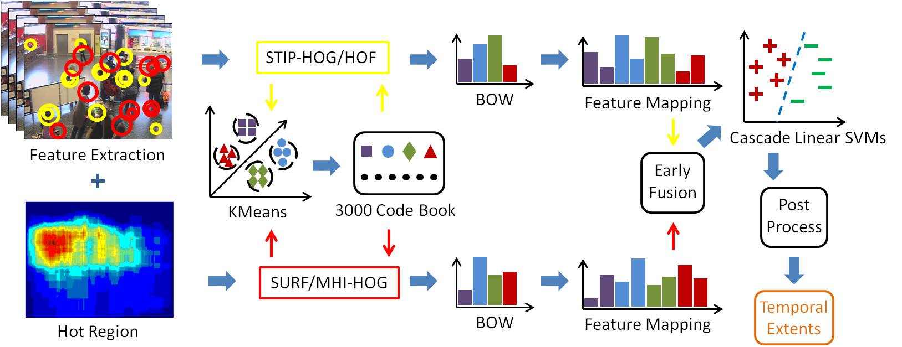
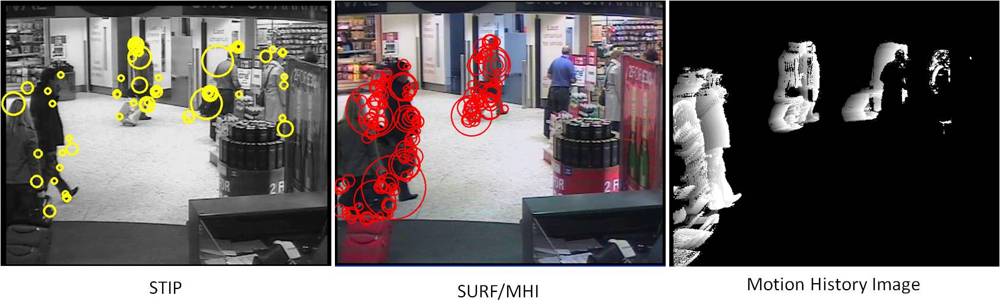
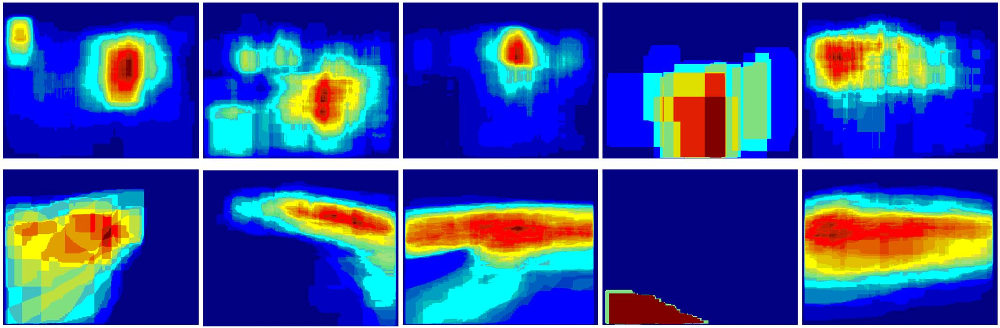
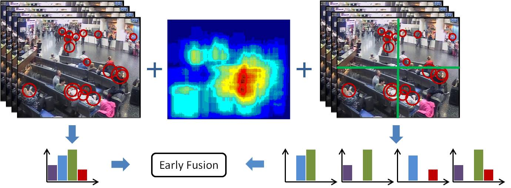
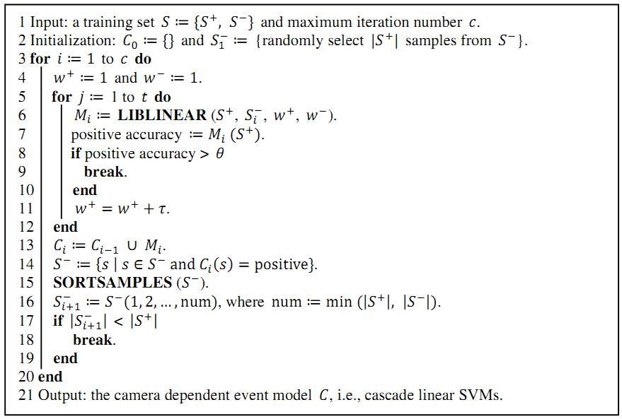
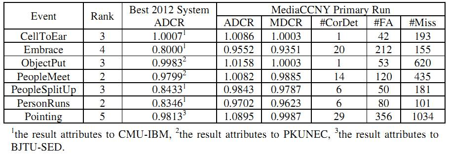

<table width="650" border="0" align="center">
<tr>
<th align="left" bgcolor="#CCCCCC" scope="col">&nbsp;<strong class="style16">Abstract</strong></th>
</tr>
</table>

<table width="650" border="0" align="center">
<tr>
<th scope="col">
Automatic activity understanding of video surveillance has many real-world security applications for public areas, such as airports, banks, supermarkets, etc. In the past decades, research of human action recognition mainly experiments on relatively small and clear scenes where only limited actors with definite actions present. This constrained scenario seldom holds in real-world surveillance videos due to challenges of large variations of viewpoint, scaling, lighting, cluttered background, etc. To bridge research efforts and real-world applications, TRECVID provides the surveillance event detection (SED) task to evaluate event detection in real-world surveillance settings. We propose a general event detection system evaluted on all the 7 SED events and achieve TOP 3 performance in 5 events. 
</th>
</tr>
</table>

<table width="650" border="0" align="center">
<tr>
<th align="left" bgcolor="#CCCCCC" scope="col">&nbsp;<strong class="style16">System Overview</strong></th>
</tr>
</table>

<table width="650" border="0" align="center">
<tr>
<th scope="col"></th>
</tr>

<tr>
<th>
Our system includes 4 main components: (1) low-level feature extraction, (2) video representation, (3) learning event models, and (4) post processing to localize event temporal extents.
</th>
</tr>
</table>

<table width="650" border="0" align="center">
<tr>
<th align="left" bgcolor="#CCCCCC" scope="col">&nbsp;<strong class="style16">Feature Extraction</strong></th>
</tr>
</table>

<table width="650" border="0" align="center">
<tr>
<th scope="col"></th>
</tr>

<tr>
<th>
We extract two types of low-level features including STIP-HOG/HOF and SURF/MHI-HOG (embeded in ActionHOG). As shown in the above figure, SURF/MHI provides denser and complementary interest points to STIP. In addition, SURF/MHI detects fewer points from background.
</th>
</tr>
</table>

<table width="650" border="0" align="center">
<tr>
<th scope="col"></th>
</tr>

<tr>
<th>
Due to the highly cluttered background, a significant amount of interest points are detected from irrelevant actions. In order to remove these noisy points, we build hot region masks based on spatial priors of specific events and cameras. The above figure shows examples of hot regions of event ObjectPut (top) and PersonRuns (bottom) corresponding to camera views of 1-5 (from left to right).
</th>
</tr>
</table>

<table width="650" border="0" align="center">
<tr>
<th align="left" bgcolor="#CCCCCC" scope="col">&nbsp;<strong class="style16">Video Representation</strong></th>
</tr>
</table>

<table width="650" border="0" align="center">
<tr>
<th scope="col"></th>
</tr>

<tr>
<th>
The BoW scheme (codebook size = 3000) combined with spatial pyramids (2 levels) is used to represent each temporal sliding window as illustrated in the above figure. We employ local soft assignment coding and max pooling for feature coding and pooling. In order to approximate large scale non-linear kernels, we apply the explicit feature mapping to enable more effcient linear SVMs with little loss in accuracy.
</th>
</tr>
</table>

<table width="650" border="0" align="center">
<tr>
<th align="left" bgcolor="#CCCCCC" scope="col">&nbsp;<strong class="style16">Learning Event Models</strong></th>
</tr>
</table>

<table width="650" border="0" align="center">
<tr>
<th scope="col"></th>
</tr>

<tr>
<th>
Since surveillance data generates quite imbalanced data (i.e., negative samples >> positive samples), we propose a CascadeSVMs algorithm to handle this high imbalance.
</th>
</tr>
</table>

<table width="650" border="0" align="center">
<tr>
<th align="left" bgcolor="#CCCCCC" scope="col">&nbsp;<strong class="style16">Experimental Resuls</strong></th>
</tr>
</table>

<table width="650" border="0" align="center">
<tr>
<th scope="col"></th>
</tr>

<tr>
<th>
Comparisons between our system and the best systems in TRECVID SED 2012 are listed in the above table. The rank column denotes our rankings among all participants in terms of the primary metric ADCR.
</th>
</tr>
</table>

<table width="650" border="0" align="center">
<tr>
<th align="left" bgcolor="#CCCCCC" scope="col">&nbsp;<strong class="style16">Related Publications</strong></th>
</tr>
</table>

**X. Yang**, C. Yi, L. Cao, and Y. Tian. MediaCCNY at TRECVID 2012: Surveillance Event Detection. NIST TRECVID Workshop, 2012. [[PDF](/publications/papers/TRECVID_2012_SED.pdf)]