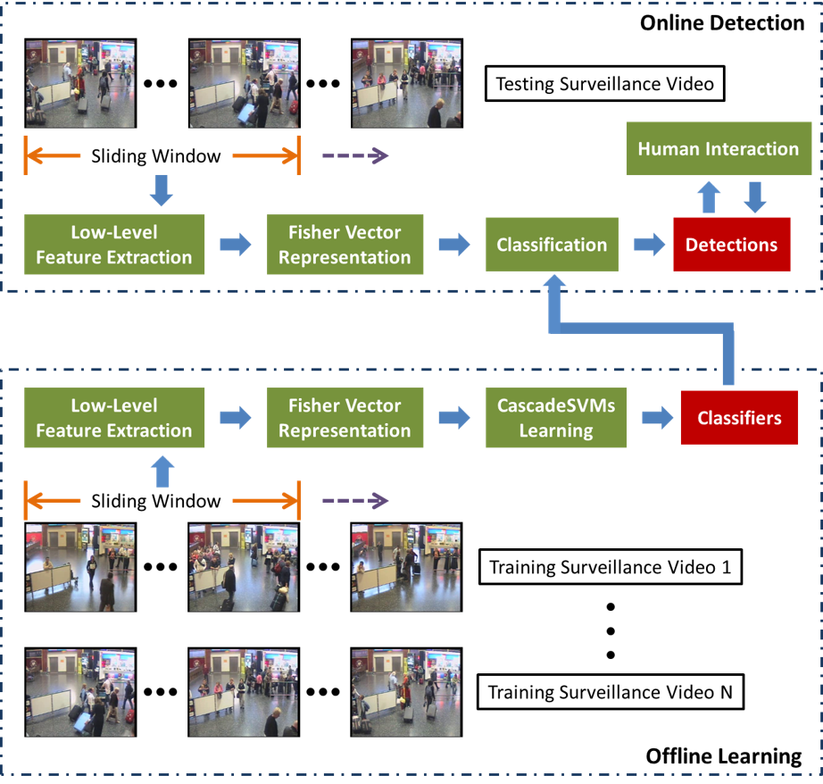
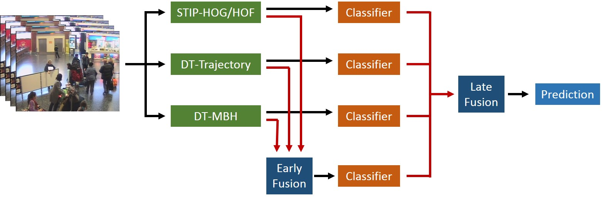
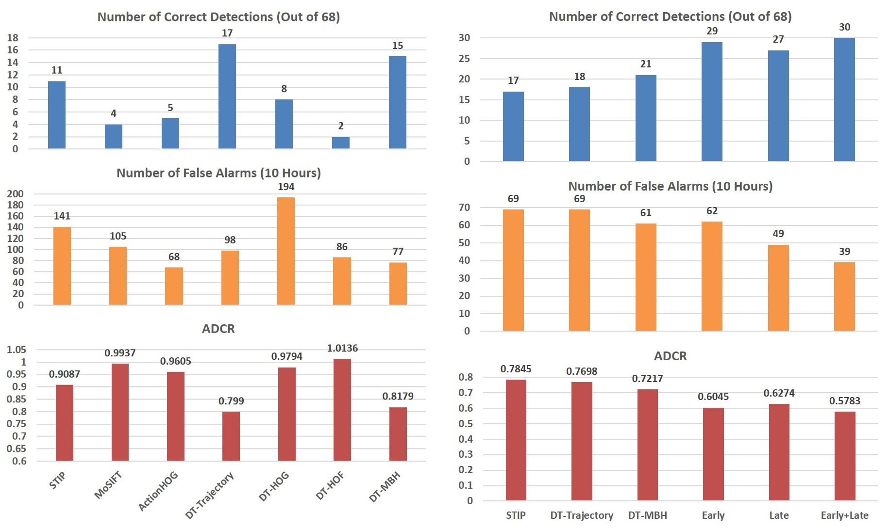
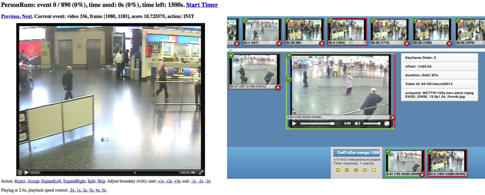
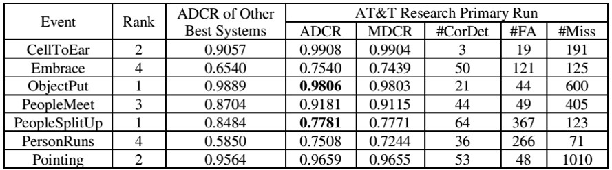

<table width="650" border="0" align="center">
<tr>
<th align="left" bgcolor="#CCCCCC" scope="col">&nbsp;<strong class="style16">Abstract</strong></th>
</tr>
</table>

<table width="650" border="0" align="center">
<tr>
<th scope="col">
We present an interactive surveillance event detection system. In the proposed system, a set of spatio-temporal features including STIP, MoSIFT, ActoinHOG, and Dense Trajectories are extracted, and a sliding temporal window is employed as the detection unit. Fisher Vector is used to encode low-level features as the representation of each sliding window. Both feature-level and decision-level fusions are used to combine multiple features. In order to deal with the highly imbalanced nature of surveillance data, the system performs detections using the CascadeSVMs algorithm according to each specific event and camera view. We develop two different interactive environments, one focuses on high throughput and the other includes related result expansion. In the primary run evaluations, our system ranks the first place on two event detection tasks. 
</th>
</tr>
</table>

<table width="650" border="0" align="center">
<tr>
<th align="left" bgcolor="#CCCCCC" scope="col">&nbsp;<strong class="style16">System Overview</strong></th>
</tr>
</table>

<table width="650" border="0" align="center">
<tr>
<th scope="col"></th>
</tr>

<tr>
<th>
Our system includes four major components: (1) low-level feature extraction, (2) video representation based on Fisher Vector, (3) event learning and predictoin by CascadeSVMs, and (4) human interaction.
</th>
</tr>
</table>

<table width="650" border="0" align="center">
<tr>
<th align="left" bgcolor="#CCCCCC" scope="col">&nbsp;<strong class="style16">Feature Extraction and Fusion</strong></th>
</tr>
</table>

<table width="650" border="0" align="center">
<tr>
<th scope="col"></th>
</tr>

<tr>
<th>
We extract and evaluate a set of local spatio-temporal features including STIP-HOG/HOF, MoSIFT, ActionHOG, DT-Trajectory, DT-HOG, DT-HOF, and DT-MBH. Both feature-level and decision-level fusions are used to combine the multiple features.
</th>
</tr>

<tr>
<th scope="col"></th>
</tr>

<tr>
<th>
We evaluate the performance of individual features and fusion schemes on a subset of the training set shown in the above figure. We keep STIP-HOG/HOF, DT-Trajectory, and DT-MBH in the final evaluation. Both early (feature-level) and late (decision-level) fusions significantly outperform any single feature. The performance can be further improved by the combination of early and late fusions.
</th>
</tr>
</table>

<table width="650" border="0" align="center">
<tr>
<th align="left" bgcolor="#CCCCCC" scope="col">&nbsp;<strong class="style16">Human Interaction</strong></th>
</tr>
</table>

<table width="650" border="0" align="center">
<tr>
<th scope="col"></th>
</tr>

<tr>
<th>
We create two interactive environments: one focuses on high throughput (left UI) and the other (right UI) includes related result expansion.
</th>
</tr>
</table>

<table width="650" border="0" align="center">
<tr>
<th align="left" bgcolor="#CCCCCC" scope="col">&nbsp;<strong class="style16">Experimental Results</strong></th>
</tr>
</table>

<table width="650" border="0" align="center">
<tr>
<th scope="col"></th>
</tr>

<tr>
<th align="left">
The comparison between our system and other best systems in TRECVID iSED 2013 is listed in the above table. The rank column denotes our rankings among all participants in terms of the primary metric ADCR.
</th>
</tr>
</table>

<table width="650" border="0" align="center">
<tr>
<th align="left" bgcolor="#CCCCCC" scope="col">&nbsp;<strong class="style16">Related Publications</strong></th>
</tr>
</table>

**X. Yang**, Z. Liu, E. Zavesky, D. Gibbon, B. Shahraray, and Y. Tian. AT&T Research at TRECVID 2013: Surveillance Event Detection. NIST TRECVID Workshop, 2013. [[PDF](/publications/papers/TRECVID_2013_SED.pdf)]